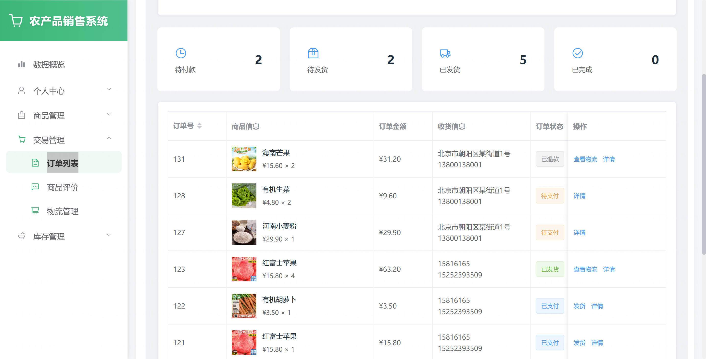

基于 Spring Boot 的农产品销售管理系统（程序+论文）
=

### 完整代码获取地址：从戎源码网 ([https://armycodes.com/](https://armycodes.com/))
### 作者微信：19941326836  QQ：952045282 
### 承接计算机毕业设计、Java毕业设计、Python毕业设计、深度学习、机器学习
### 选题+开题报告+任务书+程序定制+安装调试+论文+答辩ppt 一条龙服务
### 所有选题地址https://github.com/nature924/allProject

一、项目介绍
---

基于 Spring Boot + Vue 的农产品销售管理系统，系统角色主要为：超级管理员、商家、普通用户。主要功能如下：

超级管理员：
基本操作：登录、修改密码、获取/修改个人信息、忘记/重置密码（邮件）。
用户管理：新增/编辑/删除用户、批量删除、按角色/状态/用户名分页查询、获取用户详情。
菜单与权限：新增/编辑/删除菜单、构建菜单树、按角色下发菜单权限、分页查询菜单、获取用户菜单（权限控制）。
商品管理：新增/编辑/删除商品、分页/筛选查询、批量删除、批量/单个上下架（状态管理）、获取全部商品。
分类管理：新增/编辑/删除分类、分页/获取全部分类、批量删除。
订单管理：查看订单详情、按条件分页查询、修改订单信息、支付标记、退款申请与处理、删除/批量删除、更新收货地址、查询订单物流、获取订单状态。
库存管理：入库/出库记录管理、作废/删除操作、分页查询入/出库记录。
物流管理：新增/编辑/删除物流记录、按订单或商家分页查询、签收操作。

商家（Merchant）：
基本操作：登录、修改密码、获取/修改个人信息。
商品管理：对自身商品进行增删改、上下架、分页/筛选查询、批量操作。
库存管理：提交入库/出库单并查看处理结果。
订单与物流：查看属下订单、处理发货/更新物流、查看订单详情与状态。
内容/公告查看：查看公告、文章、轮播等。
查看系统统计（针对商家维度的数据）。

普通用户：
账号操作：注册/登录、修改密码、找回密码（邮件）、获取/修改个人信息。
商品浏览：按名称/分类/价格区间/商家/状态筛选、分页、获取商品详情、获取全部商品。
购物车：添加到购物车、编辑数量、删除单条/批量删除、分页查看用户购物车、清空购物车。
订单：创建订单、支付（支付接口标记）、查看用户订单列表、退款申请、更新收货地址、查看订单物流与状态。
地址管理：新增/编辑/删除收货地址、按用户分页查询。
收藏与评价：商品收藏（收藏/取消）、对已购商品发表评论、查看商品评论。
内容阅读：查看公告、文章、轮播信息。
接收推荐：获取个性化推荐列表。

二、项目技术
---
- 编程语言：Java
- 数据库：MySQL
- 项目管理工具：Maven
- 前端技术：VUE、HTML、Jquery、Bootstrap
- 后端技术：Spring、SpringMVC、MyBatis

三、运行环境
---
- 操作系统：Windows、macOS都可以
- JDK版本：JDK1.8以上都可以
- 开发工具：IDEA、Ecplise、Myecplise都可以
- 数据库: MySQL5.7以上都可以
- Tomcat：任意版本都可以
- Maven：任意版本都可以

四、运行截图
---
### 论文截图：

### 程序截图：

